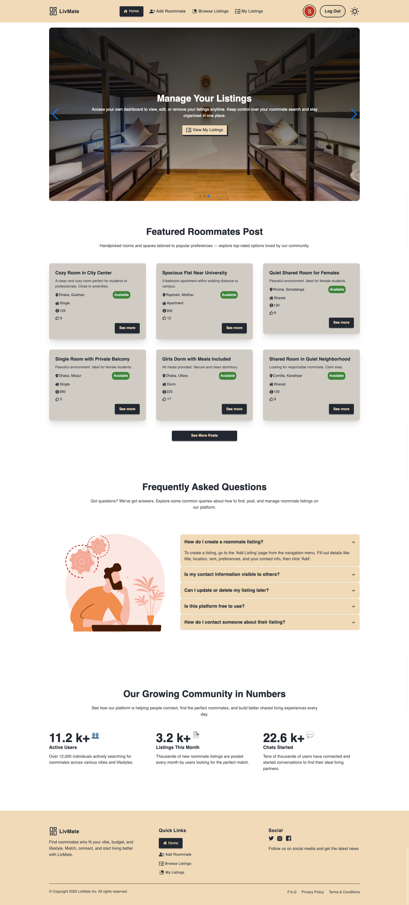

# 🏡 LivMate – Find Your Ideal Roommate


LivMate is a **responsive roommate-finding platform** that connects individuals.

**Live Site:** [https://livmate-18f71.web.app/](https://livmate-18f71.web.app/)


---

## 🚀 Features

- 🔍 Browse roommate posts filtered by availability, location, and lifestyle
- 📝 Users can:
  - Create roommate search posts
  - View and manage their own listings
  - Update or delete their posts
  - Like others' posts
- 🔐 Secure authentication using Firebase
- ✅ Private routes for user-specific functionalities
- 📱 Fully responsive design for mobile and desktop
- ⚠️ Custom 404 error page
- 🎨 Smooth animations and transitions using AOS and Lottie
- 📈 Count-up animation and Swiper sliders on the homepage
- 🌐 SEO support via `react-helmet`

---


## 📸 Screenshot



---

## Project Overview

LivMate is a **responsive roommate-finding platform** that connects individuals based on location, budget, lifestyle preferences, and interests. Users can create roommate search posts, explore available listings, and manage their own posts securely. With a clean UI, animations, and SEO support, LivMate ensures a smooth and engaging experience on all devices.


---
## 🧰 Tech Stack

### 🔹 Frontend
- **React 19**
- **React Router 7**
- **Tailwind CSS 4**
- **Firebase Authentication**
- **Vite** for fast builds
- **Axios** for API calls

### 🔹 Backend
- **Express 5**
- **MongoDB**
- **Firebase Admin SDK** – For verifying ID tokens securely.
- **dotenv** – For managing environment variables.
- **CORS** – To handle cross-origin resource sharing.

---

## 📦 Client-Side Dependencies

```json
{
  "@tailwindcss/vite": "^4.1.10",
  "aos": "^2.3.4",
  "firebase": "^11.9.1",
  "lottie-react": "^2.4.1",
  "react": "^19.1.0",
  "react-awesome-reveal": "^4.3.1",
  "react-countup": "^6.5.3",
  "react-dom": "^19.1.0",
  "react-helmet": "^6.1.0",
  "react-icons": "^5.5.0",
  "react-router": "^7.6.2",
  "react-toastify": "^11.0.5",
  "react-tooltip": "^5.29.1",
  "sweetalert2": "^11.22.0",
  "swiper": "^11.2.8",
  "tailwindcss": "^4.1.10"
}
```

### **Backend**
- `express`
- `mongodb`
- `cors`
- `dotenv`
- `firebase-admin`

---

---

## ⚙️ Environment Variables

Create `.env` files in both **client** and **server** folders.

### **server/.env.example**

```env
PORT=5000
MONGODB_URI=your_mongodb_connection_string
```

### **client/.env.example**

```env
VITE_FIREBASE_API_KEY=...
VITE_FIREBASE_AUTH_DOMAIN=...
VITE_FIREBASE_PROJECT_ID=...
VITE_FIREBASE_STORAGE_BUCKET=...
VITE_FIREBASE_MESSAGING_SENDER_ID=...
VITE_FIREBASE_APP_ID=...
```

---

## ▶️ Run Locally

1. **Clone the repository**

```bash
git clone https://github.com/Programming-Hero-Web-Course4/b11a10-client-side-SajidSojib.git
cd b11a10-client-side-SajidSojib
```

2. **Setup Backend**

```bash
cd ../b11a10-server-side-SajidSojib
cp .env.example .env
# Fill in your environment variables
npm install
npm run dev
```

3. **Setup Frontend**

```bash
cd ../b11a10-client-side-SajidSojib
cp .env.example .env
# Fill in your environment variables
npm install
npm run dev
```

4. **Access the app**

* Frontend: [http://localhost:5173](http://localhost:5173)
* Backend API: [http://localhost:5000](http://localhost:5000)

---

## 🧪 Troubleshooting

* **MongoDB Connection Error:** Check `MONGODB_URI` and network access in MongoDB Atlas.
* **Firebase Auth Issues:** Verify Firebase config and domain whitelist.
* **CORS Errors:** Confirm backend CORS settings.

---

## 🌐 Live Links

* **Frontend:** [https://livmate-18f71.web.app/](https://livmate-18f71.web.app/)


---

## 📜 License

This project is licensed under the **MIT License** — feel free to use and adapt it.


